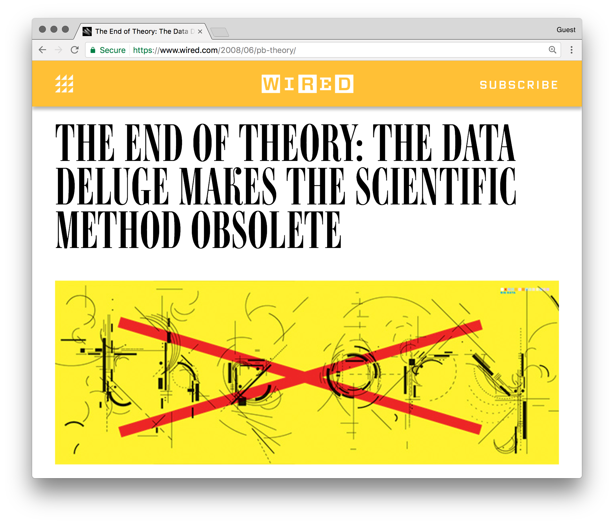

name: inverse
layout: true
class: center, middle, inverse

```{r setup, include=FALSE}
options(htmltools.dir.version = FALSE)
```

---

# Hi

???

Introduce ourselves. Thanks for opportunity. Talk about our backgrounds and different approachs to causal inference

---

# Roadmap

???

Introduce ourselves. Thanks for opportunity. Quickly talk about the structure (2 days, 8 topics, 4 topics per day, about 50-55 minutes for each topic and then 5-10 minutes for a break / questions.)

---
layout: false
.left-column[
  ## Roadmap
  ### Workshop
]
.right-column[
<br><br><br>
- **Rubin causal model.** Establish a rigorous framework for evaluating and understanding causality
]
???

So this is kind of the roadmap. First, for the workshop. Causal inference is this huge field with lots of different approaches and we can't cover it all, but we want to hit the main points. First, the Rubin causal model or the **counterfactual model**, which is by far the most popular causal framework in social science. **NEXT SLIDE**

Then, within this framework, what is the ideal situation. Like all frameworks, there are fundamental assumptions. So first we'll go over situations when these assumptions are guaranteed to be met. **NEXT SLIDE**

Then we'll start to chip away at the assumptions and loosen them up a bit. So what are all the ways we won't meet this ideal situations? **NEXT SLIDE**

Finally, we'll spend a little bit today and all of tomorrow going over ways we can address these biases using analytical methods. (NOTE: We could address many of these using design-based methods, but we likely won't have time to go over that and it's not often you get to design studies as a data scientist.)

--
.right-column[
- **Experimental designs.** Within this framework, discuss the *ideal* situation for inferring causality, randomized control trials
]
--
.right-column[
- **Confounding and selection.** Ways non-experimental designs can be biased
]
--
.right-column[
- **Methods and application.** Finally, go over methods that mimic experiments in order to infer causality in real-world settings
]

---
layout: false
.left-column[
  ## Roadmap
  ### Workshop
  ### Today
]
.right-column[
<br><br>
- **Introduciton to Causal Inference**. Establish a framework we can all use.
]
???
So for today, we're going to do four talks. First, we're going to make sure we are all on the same page about what causal inference is. **NEXT SLIDE**

Second, within this framework, let's talk about estimating a causal effect in a best case scenario. **NEXT SLIDE**

Third, we'll talk about different obstacles to estimating causal effects. In the real world setting a randomized control trial is often not feasible or ethical so what can we do to ensure we aren't breaking the assumptions of our framework? **NEXT SLIDE**

And then we'll introduce a method to overcome some of these obstacles called instrumental variables and talk about how it attempts to mimic an RCT.
--
.right-column[
- **Estimating Causal Effects.** Within this framework, how do we estimate a "causal effect" in the ideal case -- a randomized control trial.
]
--
.right-column[
- **Obstacles to Estimation.** In the real world, we have a variety of biases. What do we do?
]
--
.right-column[
- **Instrumental variables.** First example of overcoming biases and how IV relates to our ideal case.
]

---
layout: false
.left-column[
  ## Roadmap
  ### Workshop
  ### Today
  ### Now
]
.right-column[
<br><br>
- **Motivation.** Why do we care about causal inference at all?
]
--
.right-column[
- **Definition.** What is causal inference? 
]
--
.right-column[
- **Rubin causal model.** A framework for evaluating causality
]

---
template: inverse

## Motivation
### Why do we care about causal inference at all?

???
So why do we even care about causal inference? Obviously, you guys care because you're here, but why should data scientists in general care about causal inference? This is an article from Wired Magazine and it has a bit of the sentiment we see a lot now.

---
layout: false
.left-column[
  ## Motivation

"Scientists are trained to recognize that correlation is not causation, that no conclusions should be drawn simply on the basis of correlation between X and Y (it could just be a coincidence)."
]

.right-column[
<br><br><br>

]

---
layout: false
.left-column[
  ## Motivation
"There is now a better way. Petabytes allow us to say: 'Correlation is enough.'"
]
.right-column[
<br><br><br>

]

---
layout: false
.left-column[
  ## Motivation
  ### Causal Inference Gone Bad
]
--
.right-column[
<br><br>
## eBay example
Does an increase in spending on keyword advertisements increase my return?
.footnote[Blake, T., Nosko, C. and Tadelis, S. (2015)]
]
--
.right-column[
Prior: Targeted internet advertising is highly effective (you get people who are interested in your product)
]
--
.right-column[
Predictive models indicate ad clicks translates to increased success
]

---
layout: false
.left-column[
  ## Motivation
  ### Causal Inference Gone Bad
]
.right-column[
<br><br>
## eBay example
Causal question: **Compared to not increasing ad revenue**, how much does an increase in ad revenue affect my return?
.footnote[Blake, T., Nosko, C. and Tadelis, S. (2015)]
]
--
.right-column[
Design: Stop advertising on two search engines, but continue on one.
]
--
.right-column[
Results: Almost everybody found the site through unpaid search traffic. (Other studies show the returns to be *negative*)
]
--

---
.left-column[
  ## Motivation
  ### Example 1
  ### Example 2
  ### Example 3
]
.right-column[
Last one.

- Bullet points with more
- Bullet points

- Last example
]

---
template: inverse

## Definition
### What is causal inference?

---
template: inverse

## Rubin causal model
### A framework for evaluating causality
---
.left-column[
  ## Rubin causal model
  ### Example 1
  ### Example 2
  ### Caveat
]
.right-column[
## There is a lot of debate
]
--
.right-column[
Despite how it will feel when reading the literature, this is not the **only** framework of causal inference. 
]
--
.right-column[
It is a useful, but very limited, framework -- especially when evaluating things with no well-defined intervention. (For example, "Does obesity increase the risk of premature mortality?")
]
--
.right-column[
For an example, see debate in epidemiology between Nancy Krieger.red[*] et al. and Jamie Robins et al.
]


---
class: center, middle
# Thanks!

---
# Sources

- [Wired Article](https://www.wired.com/2008/06/pb-theory/): https://www.wired.com/2008/06/pb-theory/
- [eBay example](http://onlinelibrary.wiley.com/doi/10.3982/ECTA12423/abstract) - Blake, T., Nosko, C. and Tadelis, S. (2015), Consumer Heterogeneity and Paid Search Effectiveness: A Large-Scale Field Experiment. Econometrica, 83: 155–174. doi:10.3982/ECTA12423
- [Jennifer Hill talk](http://cds.nyu.edu/wp-content/uploads/2014/04/causal-and-data-science-and-BART.pdf)

---
# Additional Reading
- [We are all data scientists now](https://stanford.edu/~jgrimmer/bd_2.pdf) - Grimer 2015 (doi:10.1017/S1049096514001784)