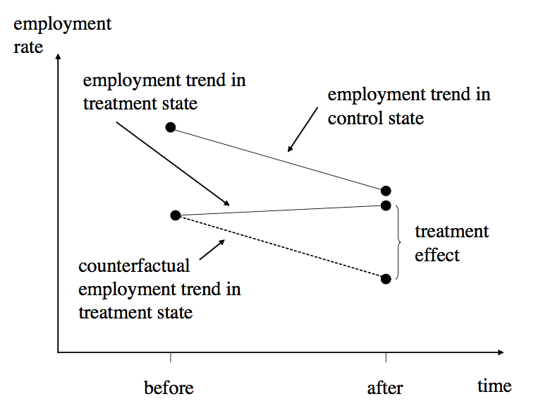

name: inverse
layout: true
class: center, middle, inverse

```{r setup, include=FALSE}
options(htmltools.dir.version = FALSE)
```

---

# Power of Time Serieses (sp??)

- Previously:
  - covered (quasi-)randomized trials
  - use of regression to control for factors and create conditional independence
  - observational data using IVs
  
- Now:
  - take advantage of repeated observations (on the same unit) over time
  - key idea: requires meaningful variation (to get our identification strategy!)
  - key idea: basically, a carefully thought out version of "*before-and-after*"
    - comparing trends!

---
# Examples of Panel/Longitudinal Data

- neighborhood rent prices over time
- Facebook activity for users over time
- purchasing activity at Amazon or chain store over time
- physical activity measured over time
- government-tracked records over time
- lots of other cool examples...


---
# Key topics to cover:

- Fixed Effects
- Diff-in-Diff

---
# Fixed Effects

- unable to observe data on IQ, ability, motivation, parental influence, etc.
- however, we may argue that this is constant over time
- if so, then we can remove this constant using time series data
- and only look at deviations from that individual-constant

- same thing could be argued for locations, or businesses

$E[Y_{0it}|A_i,X_{it},t,D_{it}] = E[Y_{0it}|A_i,X_it,t]$

Can assume the counterfactual is easily calculated using:
$$E[Y_{0it}|A_i,X_{it},t] = \alpha+\lambda_t+A_i^{'} \gamma + X^{'}_{it} \beta$$

---
# Diff-in-Diff

- individual fixed effects are not enough?
  - when the "meaningful variation over time" occurs not between individuals, but at a larger level at the same time (state level, company wide)
  - hard to identify since there are state level unobserved attributes and aspects

- use another comparison aggregate level to estimate the comparable trend / counterfactual.




---
# Brief Math Overview of DiD

- regression interpretation
- interactions between measurement units (e.g. people, counties, firms) and time-dependent regional-level treatment indicators

---
# Sources

- Cameron & Triveti textbook
- Mostly Harmless Econometrics
- Osea Giuntella, slides