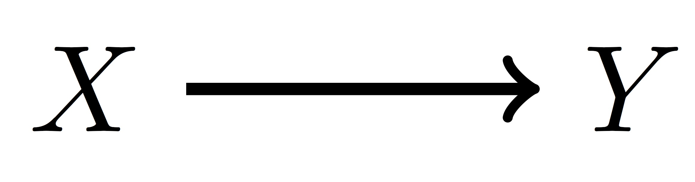

```{r setup, include=FALSE}
options(htmltools.dir.version = FALSE)
```

class: center, middle

# Roadmap

???

Ok. Now that we have a general understanding of Rubin Causal Model, we're going to take a step back and learn about DAGs and then under what conditions the RCM will work.
---
# Causal Directed Acyclic Graphs (DAGs)

.center[]

- Graphically, the goal is to estimate magnitude and direction arrow. Statistically, we can only estimate the magnitude

- The edge itself can exist for at least 5 reasons:
    1. Just random luck
    1. $X$ really does cause $Y$
    1. $Y$ actually causes $X$
    1. $X$ and $Y$ share a common cause
    1. $X$ and $Y$ have a common effect that we are conditioning on
    
- Our job is to figure out which of these reasons is most consistent with the data and rule out all other explanations

.footnote[.red[*]Ch 16 by Maria Glymour in Methods Social Epidemiology]
    
---
# Rules for *drawing* a DAG

.center[]

- Time flows left to right (thus arrows always point right)

- An arrow implies our belief that something is *causal*

- The lack of an arrow implies our belief that things are *not* causal

- Everything we are concerned with exists in the DAG

.footnote[.red[*]Ch 16 by Maria Glymour in Methods Social Epidemiology]

---
# Reading DAGs: Causal assumptions

.center[]

- $X$ and $U$ are direct causes of $Y$
- $Y$ is a direct cause of $Z$
- $X$/$U$ are *not* direct causes of $Z$, but *indirect* causes through $Y$
- $X$ and $U$ are not causes of each other
- No two variables share a common cause

.footnote[.red[*]Ch 16 by Maria Glymour in Methods Social Epidemiology]

---
# Reading DAGs: Statistical implications

.center[]

- Edge implies statistical dependence
- No statistical dependence if there is a *collider*. Two arrow heads into one variable ($U \rightarrow Y \leftarrow X$)
- No statistical dependence if we *condition* or *block* a variable (denoted with a box around that variable) or a *descendent* of that variable
- There is statistical dependence if we block a collider or a descendent of that collider

.footnote[.red[*]Ch 16 by Maria Glymour in Methods Social Epidemiology]


---
# Reading DAGs: Statistical implications
.footnote[.red[*]Ch 16 by Maria Glymour in Methods Social Epidemiology]

.center[]

- $X$ and $Y$ are statistically dependent
- $U$ and $Y$ are statistically dependent
- $Y$ and $Z$ are statistically dependent

--
- $X$ and $Z$ are statistically dependent ($X \rightarrow Y \rightarrow Z$)
- $U$ and $Z$ are statistically dependent ($U \rightarrow Y \rightarrow Z$)

---
# Reading DAGs: Statistical implications
.footnote[.red[*]Ch 16 by Maria Glymour in Methods Social Epidemiology]

.center[]

- $X$ and $U$ are statistically independent (blocked by a collider $Y$)

--
- $X$ and $U$ are statistically dependent, conditional on $Y$ (conditioning on a collider, unblocks that path)

--
- $X$ and $U$ are statistically dependent, conditional on $Z$ (conditioning on a collider's descendent, unblocks that path)

--
- $X$ and $Z$ are statistically independent, conditional on $Y$ (conditioning on $Y$ blocks the $X \rightarrow Y \rightarrow Z$ path)

--
- Similar to above, $U$ and $Z$ are statistically independent, conditional on $Y$.

---
# DAGs Assumptions
.footnote[.red[*]Ch 16 by Maria Glymour in Methods Social Epidemiology]

.center[]

1. **Causal Markov Assumption.** Any variable $X$ is independent of any other variable $Y$ conditional on on the direct causes of $X$ (unless $Y$ is an effect of $X$).
1. **Faithfulness.** Positive and negative causal effects never *perfectly* offset. 
1. **Neglible randomness.** Statistical associations (or lack of such associations) are never due to random change (i.e., large sample size assumption).

---
# DAGs Conclusion
.center[]

### Powerful way of elucidating our beliefs and assumptions with only a few nodes and edges


---
class: center, middle
# Thanks!

---
# Sources

- [Chapter 16 Methods in Social Epidemiology](http://publicifsv.sund.ku.dk/~nk/epiF14/Glymour_DAGs.pdf) by Maria Glymour


---
# Additional Reading
- TODO